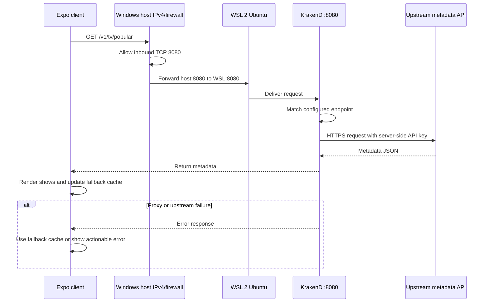

# Work log — October 6, 2026

## Backend proxy accomplishment

- Replaced the active Expo client's direct upstream metadata request with a request to the application proxy:
  - `GET /v1/tv/popular`
- Removed the upstream service host, API-key placeholder, and upstream identifiers from the active client files.
- Added a proxy image route so poster and backdrop requests also go through the proxy instead of making the client depend directly on the upstream image host.
- Added a ten-second proxy request timeout so the app cannot remain in a perpetual loading state when the proxy is unreachable or stalled.
- Preserved the existing fallback-cache behavior:
  - Successful proxy responses update the in-memory cache.
  - Failed requests use cached shows when available.
  - If no cache exists, the app displays an actionable error.

## KrakenD configuration

- Added [`krakend/krakend.json`](./krakend/krakend.json).
- Added the public endpoint:
  - `/v1/tv/popular`
- Configured KrakenD to call the upstream TV metadata endpoint and inject `TMDB_API_KEY` server-side.
- Added `/v1/images/{size}/{path}` for proxy-served artwork.
- Enabled readable gateway error messages and transparent upstream status/error responses.
- Added [`krakend/.env.example`](./krakend/.env.example), [`krakend/docker-compose.yml`](./krakend/docker-compose.yml), and [`krakend/README.md`](./krakend/README.md).
- The real API key is not stored in the repository or Expo bundle. It belongs in the local/server environment only.

## Runtime architecture

KrakenD is installed as a compiled Linux executable inside Ubuntu running on WSL 2. A binary is a ready-to-run compiled program; it is not source code, a Node package, or a Docker container.

## WSL and networking setup

- Enabled WSL 2.
- Installed Ubuntu as the Linux distribution inside WSL 2.
- Installed KrakenD Community Edition `2.13.11` inside Ubuntu.
- Validated the KrakenD configuration with:
  - `krakend check --lint`
- Confirmed KrakenD listens on WSL port `8080` and returns data from `/v1/tv/popular`.
- Configured the Windows IPv4 port-forward from the LAN host address to the WSL KrakenD listener:
  - Windows host: `10.250.111.178:8080`
  - WSL Ubuntu: `192.168.99.174:8080`
- Added the Windows firewall permission for inbound TCP port `8080` on the Private profile.
- Expo uses the public proxy base URL, for example:
  - `http://10.250.111.178:8080`

The firewall rule permits the inbound connection to the Windows host. The port-forward then routes that connection into WSL, where KrakenD is listening.

## Client documentation and observability

- Added readable comments to the active [`App.tsx`](./App.tsx) explaining each function's purpose and its role in the proxy, cache, error, and UI workflow.
- KrakenD access logs can be observed in the Ubuntu terminal while KrakenD runs in the foreground. A successful request appears as a `GET` for `/v1/tv/popular` with its HTTP status and duration.
- Expo logs successful metadata refreshes and proxy failures without logging the API key.

## Validation

- KrakenD configuration syntax: passed — `Syntax OK!`
- Jest: passed — 4 tests.
- ESLint: passed.
- TypeScript: passed.
- Expo emulator became usable after `emulator-5554` was authorized in ADB.
- The proxy and Expo client are now working together through the Windows IPv4-to-WSL forwarding path.

## Security status

- The API key is not present in active client source files.
- The API key is not part of the Expo public configuration.
- The local `krakend/.env` file is ignored by Git.
- The proxy base URL is public configuration; the credential remains server-side.

